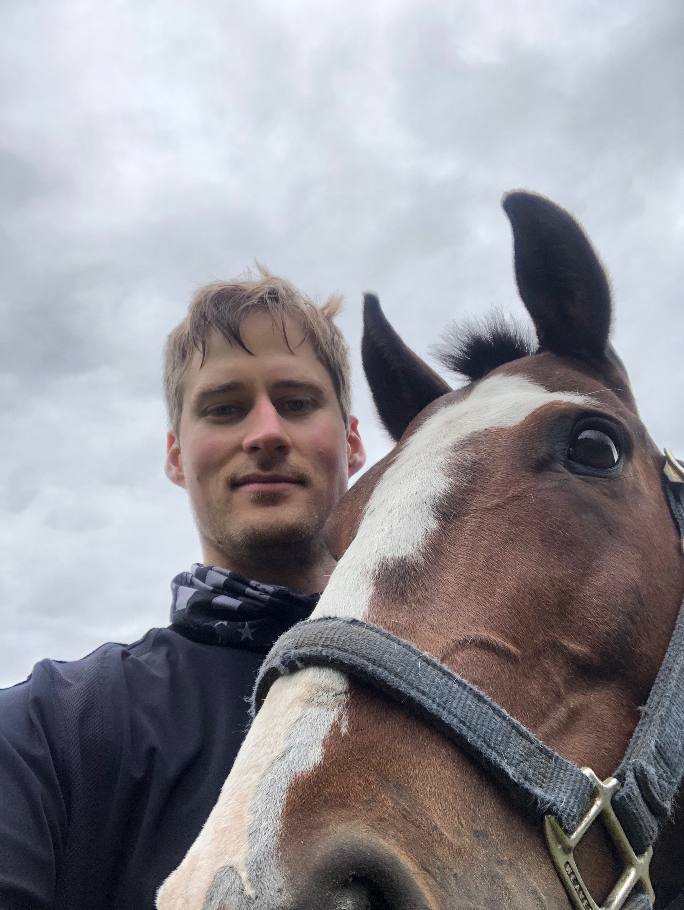

## Inspiration:
This project is a culmination of the University of Michigan Masters in Applied Data Science program. Both Phil Michaels and David Dunstan have worked in the pharmaceutical industry for over 10 years with backgrounds in analytical chemistry, small molecule purification, High-throughput synthesis and automation. The authors have pursued this Master's program to help better bridge data science with the laboratory work used to generate the data and advance the field of drug discovery.

### Phil Michaels [LinkedIn](https://www.linkedin.com/in/philip-michaels-9234b47b/)

### David Dunstan [LinkedIn](https://www.linkedin.com/in/david-dunstan-40a2aa55/)

## Statement of Work:
Both authors contributed to the coding, writing of the technical report and the development and testing of models. David developed the initial project outline and was responsible for piloting and executing the preliminary coding for the project and developing the cheminformatics aspects. David also produced most of the notebooks that served as a starting point for Phil to develop the more complete and robust pipeline. Phil developed the pipeline used to train, produce and evaluate the data for this project. Phil also piloted and developed the approach using the Great Lakes Cluster that was ultimately used to train the Chemprop model. Phil also built interactive visualizations, but unfortunately we were unable to get them working properly within the ultimate blog post, so included screenshots in the final report. 
