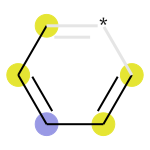

# Cheminformatics tutorial NB

This notebook can be used to provide a brief introduction to some approaches to utilize chemical structure information in data science. This notebook pulls from examples found both in the RDkit documentation as well as some from other websources and are cited accordingly. 


```python
from rdkit import Chem
```

What is a molecule? A set of atoms that can be drawn as a 2D depiction:


```python
benzene=Chem.MolFromSmiles('c1ccccc1') # Smiles representation (strings of letters/numbers/symobls)
benzene
```


    

    


Here is an example of a more complex molecule, Gleevec which is a chemothereputic agent for leukemia:


```python
gleevec=Chem.MolFromSmiles('CC1=C(C=C(C=C1)NC(=O)C2=CC=C(C=C2)CN3CCN(CC3)C)NC4=NC=CC(=N4)C5=CN=CC=C5')
gleevec
```


    

    


We can then save these images to a file.


```python
Chem.Draw.MolToFile(benzene,'2D_sctructure_benzene.png',size=(300,300))
```


```python
Chem.Draw.MolToFile(gleevec,'2D_sctructure_gleevec.png',size=(300,300))
```

Here is another example of a 6 carbon ring system, only this time each carbon atom is connected by a single bond instead of the aromatic bonds above.


```python
cyclo_hexane=Chem.MolFromSmiles('C1CCCCC1') # Smiles representation (strings of letters/numbers/symobls)
Chem.Draw.MolToFile(cyclo_hexane,'2D_sctructure_cyclohexane.png',size=(300,300))
cyclo_hexane
```


    

    


```python
from rdkit.Chem import AllChem
import numpy as np
np.set_printoptions(threshold=np.inf)
```

Using RDkit, we can easily convert these representations into a vectorized format. Here we show an example of a Morgan or circular fingerprint of radius 2 and length 100. 


```python
# We can represent a molecule as a fingerprint
radius=2
bits=100
np.array(AllChem.GetMorganFingerprintAsBitVect(gleevec,radius,nBits=bits))
# This will produce a vector based on the representation 
```


    array([1, 0, 0, 1, 0, 0, 0, 0, 1, 0, 1, 0, 1, 1, 1, 1, 1, 0, 1, 1, 0, 0,
           0, 0, 0, 1, 0, 1, 0, 0, 1, 1, 0, 0, 1, 0, 0, 1, 0, 1, 0, 0, 0, 1,
           0, 1, 1, 1, 1, 0, 0, 0, 0, 0, 1, 1, 0, 0, 0, 1, 0, 0, 0, 0, 1, 0,
           1, 0, 1, 1, 1, 0, 1, 1, 0, 1, 1, 1, 0, 0, 1, 0, 1, 1, 1, 1, 0, 0,
           1, 1, 1, 1, 0, 0, 1, 1, 1, 1, 0, 1])


```python
np.array(AllChem.GetMorganFingerprintAsBitVect(benzene,radius,nBits=bits))
```


    array([0, 0, 0, 0, 0, 0, 0, 0, 0, 0, 0, 0, 0, 1, 0, 0, 0, 0, 0, 0, 0, 0,
           0, 0, 0, 0, 0, 0, 0, 0, 0, 0, 0, 0, 0, 0, 0, 0, 0, 0, 0, 0, 0, 0,
           0, 0, 0, 0, 0, 0, 0, 0, 0, 0, 0, 0, 0, 0, 0, 0, 0, 0, 0, 0, 0, 0,
           0, 0, 0, 1, 0, 0, 0, 0, 0, 0, 0, 0, 0, 0, 0, 0, 0, 0, 1, 0, 0, 0,
           0, 0, 0, 0, 0, 0, 0, 0, 0, 0, 0, 0])


Above we can see the difference reflected in the two finger prints. Normally, more bits are used to avoid collisions between different molecules. If we look at the substructure tied to each bit-vector above, we can see that using 100 bits for these molecules results in a collision. 


```python
from rdkit.Chem import Draw # https://www.rdkit.org/docs/GettingStartedInPython.html
bi = {}
fp = AllChem.GetMorganFingerprintAsBitVect(gleevec, radius=2, bitInfo=bi,nBits=bits)
bi

```


    {0: ((31, 1),),
     3: ((35, 2),),
     8: ((1, 0), (2, 0), (4, 0), (10, 0), (13, 0), (25, 0), (29, 0), (31, 0)),
     10: ((33, 2),),
     12: ((29, 1),),
     13: ((16, 1),),
     14: ((25, 2),),
     15: ((8, 0),),
     16: ((7, 0), (24, 0), (17, 2)),
     18: ((31, 2),),
     19: ((24, 2),),
     25: ((28, 2),),
     27: ((8, 2),),
     30: ((9, 0), (1, 2)),
     31: ((20, 1),),
     34: ((27, 1), (34, 1)),
     37: ((0, 0), (23, 0), (32, 2)),
     39: ((17, 0), (20, 0), (24, 1), (16, 2)),
     43: ((1, 1), (6, 2), (26, 2)),
     45: ((10, 2),),
     46: ((7, 2),),
     47: ((17, 1), (13, 2), (5, 2)),
     48: ((18, 1), (19, 1), (21, 1), (26, 1), (22, 1)),
     54: ((13, 1), (25, 1)),
     55: ((30, 2),),
     59: ((27, 2),),
     64: ((2, 2),),
     66: ((0, 1),),
     68: ((7, 1),),
     69: ((3, 0),
      (5, 0),
      (6, 0),
      (11, 0),
      (12, 0),
      (14, 0),
      (15, 0),
      (27, 0),
      (28, 0),
      (32, 0),
      (34, 0),
      (35, 0),
      (36, 0)),
     70: ((5, 1), (11, 1), (12, 1), (14, 1), (28, 1), (6, 1), (15, 1), (36, 1)),
     72: ((16, 0),),
     73: ((3, 2),),
     75: ((30, 1),),
     76: ((2, 1),),
     77: ((10, 1),),
     80: ((20, 2), (36, 2)),
     82: ((18, 2), (22, 2)),
     83: ((33, 1),),
     84: ((35, 1),),
     85: ((34, 2),),
     88: ((29, 2),),
     89: ((9, 1),),
     90: ((26, 0), (30, 0), (33, 0), (8, 1), (12, 2), (19, 2), (14, 2), (21, 2)),
     91: ((4, 1),),
     94: ((18, 0), (19, 0), (21, 0), (22, 0)),
     95: ((32, 1),),
     96: ((4, 2),),
     97: ((23, 1), (11, 2), (15, 2)),
     99: ((3, 1),)}


We can view the substructure from each bit as follows. From this we can see that while bit 69 is the same in both molecules (rotation does not matter here) bit 13 is different.


```python
# Show what structure is tied to this fingerprint:
mfp2_svg = Draw.DrawMorganBit(gleevec, 69, bi, useSVG=True)
mfp2_svg
```


    

    


```python
mfp2_svg = Draw.DrawMorganBit(gleevec, 13, bi, useSVG=True)
mfp2_svg
```


    

    


```python
bi = {}
fp = AllChem.GetMorganFingerprintAsBitVect(benzene, radius=2, bitInfo=bi,nBits=bits)
bi
```


    {13: ((2, 2), (3, 2), (1, 2), (0, 2), (5, 2), (4, 2)),
     69: ((0, 0), (1, 0), (2, 0), (3, 0), (4, 0), (5, 0)),
     84: ((1, 1), (2, 1), (3, 1), (4, 1), (0, 1), (5, 1))}


```python
mfp2_svg = Draw.DrawMorganBit(benzene, bitId=69, bitInfo=bi, useSVG=True)
mfp2_svg
```


    

    


```python
mfp2_svg = Draw.DrawMorganBit(benzene, bitId=13, bitInfo=bi, useSVG=True)
mfp2_svg
```


    

    


These fingerprints can then be used as a molecular representation to perform common data science tasks. For example, we can calculate the similarity of two molecules here. Later in the project we will demonstrate how to utilize these representations to train and evaluate models for a variety of drug discovery related datasets.


```python
# For example we can compare the similarity between two vectors:
from rdkit import DataStructs
benzene_fp=AllChem.GetMorganFingerprintAsBitVect(benzene, radius=2, bitInfo=bi,nBits=bits)
gleevec_fp=AllChem.GetMorganFingerprintAsBitVect(gleevec, radius=2, bitInfo=bi,nBits=bits)
print(DataStructs.TanimotoSimilarity(benzene_fp,gleevec_fp))

```

    0.06


```python
# compare two molecules that are more similar:
pyridine=Chem.MolFromSmiles('c1ncccc1')
pyridine_fp=AllChem.GetMorganFingerprintAsBitVect(pyridine, radius=2, nBits=bits)
pyridine.SetProp('name','pyridine')
benzene.SetProp('name','benzene')
gleevec.SetProp('name','Gleevec')

sim_pyr= DataStructs.TanimotoSimilarity(pyridine_fp,benzene_fp)
sim_ben=DataStructs.TanimotoSimilarity(benzene_fp,benzene_fp)
sim_gleevec=DataStructs.TanimotoSimilarity(benzene_fp,gleevec_fp)
print([sim_pyr,sim_ben,sim_gleevec])
pyridine.SetDoubleProp('sim_benzene',sim_pyr)
benzene.SetDoubleProp('sim_benzene',sim_ben)
gleevec.SetDoubleProp('sim_benzene',sim_gleevec)

Draw.MolsToGridImage([benzene,pyridine,gleevec],molsPerRow=3,subImgSize=(400,400),legends=[f'Name: {x.GetProp("name")} \n Similarity: {round(float(x.GetProp("sim_benzene")),2)}' for x in [benzene,pyridine,gleevec]])

```

    [0.3333333333333333, 1.0, 0.06]


    

    


```python
DataStructs.TanimotoSimilarity(pyridine_fp,benzene_fp) # these are much more similar
```


    0.3333333333333333


There are a multitude of other tasks that can be done on the chemical structures, however we hope that this brief introduction will help give background to better understand our project. 


```python

```
